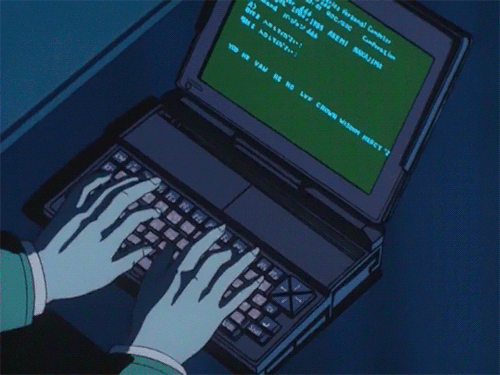

                        

<h2 align="center">📋&ensp; <i>Ｓｏｂｒｅ</i> &ensp;📋</h2>

<!-- <table align="center">
  <tr>
    <td>
      <b>
        <a href="README.md">🇧🇷 Português</a>
      </b>
    </td>
    <td>
      <a href="README-EN.md">🇺🇸 English</a>
    </td>
  </tr>
</table> -->
<ul align="left">
    <li>🤩️ Gosto muito de Tecnologia, Animes, Jogos, Eventos; 🤩️</li> 
    <li>🚀 Estudando e aprimorando as skills para em um futuro próximo me tornar um Desenvolvedor FullStack, penso em um dia morar em outros países, viajar o mundo e ser um ótimo profissional 🚀</li> 
    <li>💻 Curso Engenharia de Software na <a href="https://www.unirv.edu.br/index.php" target="_blank">UniRV</a> aprendendo <b>C</b> e <b>Java</b>. De contra-mão, adquiri o curso da <a href="https://www.rocketseat.com.br/" target="_blank">Rocketseat</a> e venho aprendendo bastante <b>HTML</b> e <b>CSS</b>, com uma didática excelente, ainda irei aprender <b>JavaScript</b>, <b>Node</b>, <b>React</b> e complementar meus conhecimentos em <b>SQL</b>, <b>Git</b> e <b>Github</b>. 💻</li> 
    <li>🔮 Meu objetivo mais distante seria um dia trabalhar em uma </b>Big Tech</b> como a <b>Microsoft</b> ou <b>Google</b>. Enquanto isso, irei dar meu melhor para subir na escada do sucesso, degrau por degrau, no meu tempo. 🔮</li> 
</ul>
 

<h2 align="center">🛠️&ensp; <i>Ｔｅｃｎｏｌｏｇｉａｓ</i> &ensp;🛠️</h2>

<table align="right" height="300px">
  <tr>
    <td align="center">
       
      
        <b>
          <pre>HTML</pre>
        </b>
      
    </td>
    <td align="center">
       
      
        <b>
          <pre>&ensp;CSS&ensp;</pre>
        </b>
      
    </td>
    <td align="center">
       
      
        <b>
          <pre>JavaScript</pre>
        </b>
      
    </td>
    <td align="center">
       
      
        <b>
          <pre>SQL</pre>
        </b>
      
    </td>
    <td align="center">
       
      
        <b>
          <pre>Java</pre>
        </b>
      
    </td>
  </tr>
  
  <tr>
  <td align="center">
       
      
        <b>
          <pre>VSCode</pre>
        </b>
      
    </td>
    <td align="center" width="100px;">
       
      
        <b>
          <pre>&emsp;GitHub&emsp;</pre>
        </b>
      
    </td>
    <td align="center" width="100px;">
       
      
        <b>
          <pre>&emsp;Git&emsp;</pre>
        </b>
      
    </td>    
    <td align="center">
       
      
        <b>
          <pre>Figma</pre>
        </b>
      
    </td>
    <td align="center">
       
      
        <b>
          <pre>Markdown</pre>
        </b>
      
    </td> 
  </tr>
</table> 

<!-- Techs que ainda não aprendi 
<td align="center">
       
      
        <b>
          <pre>Yarn/npm</pre>
        </b>
      
    </td>

    <td align="center">
       
      
        <b>
          <pre>TypeScript</pre>
        </b>
      
    </td>
    
    <td align="center">
       
      
        <b>
          <pre>Tailwind</pre>
        </b>
      
    </td>
    
    <td align="center">
       
      
        <b>
          <pre>NodeJS</pre>
        </b>
      
    </td>
    
    <td align="center">
       
      
        <b>
          <pre>Terminal</pre>
        </b>
      
    </td>

    <td align="center">
       
      
        <b>
          <pre>Insomnia</pre>
        </b>
      
    </td>

    <td align="center">
       
      
        <b>
          <pre>React</pre>
        </b>
      
    </td> 
    
     <td align="center">
       
      
        <b>
          <pre>Vite</pre>
        </b>
      
    </td> 
-->

               

<h2 align="center">💬&ensp; <i>Ｃｏｎｔａｔｏ</i> &ensp;💬</h2>

  

   
  
  
   
  
  

   

<h2 align="center">👨🏻‍💻&ensp; <i>Ｐｒｏｊｅｔｏｓ</i> &ensp;👨🏻‍💻</h2>

<table height="495px" width="365px">
  <tr>
    <td>
    
    </td>
  </tr>
    <tr>
    <td>
    
    </td>
  </tr>
  <tr>
    <td>
    
    </td>
  </tr>
  <tr>
    <td>
    
    </td>
  </tr>
  <tr>
    <td>
    
    </td>
  </tr>
  <tr>
    <td>
    
    </td>
  </tr>
  <tr>
    <td>
    
    </td>
  </tr>
  <tr>
    <td>
     
    </td>
  </tr>
  <tr>
    <td>
    
    </td>
  </tr>
  <tr>
    <td>
    
    </td>
  </tr>
  <tr>
    <td>
    
    </td>
  </tr>
  <tr>
    <td>
    
    </td>
  </tr>
</table>
 

<h2 align="center">

📈&ensp; <i>Ａｔｉｖｉｄａｄｅｓ</i> &ensp;📈

 

  

 

