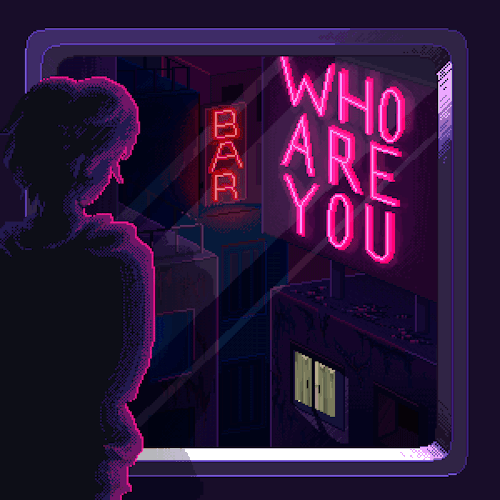

<!-- INTRO -->

                     

<h3 align="center">  
 

Oi, eu sou o Rhogger, acompanhe minha evolução pelo GitHub! 😃
 
 
</h3>

<!-- FIM INTRO -->

<!-- SOBRE MIM -->

<h2 align="center"><b>Sobre mim</b></h2>

<ul align="left">
    <li> Gosto muito de Tecnologia, Animes, Jogos, Eventos;</li> 
    <li> Estudando e aprimorando as skills para em um futuro próximo me tornar um Desenvolvedor FullStack, penso em um dia morar em outros países, viajar o mundo e ser um ótimo profissional;</li> 
    <li>Curso Engenharia de Software na <a href="https://www.unirv.edu.br/index.php" target="_blank">UniRV</a> aprendendo <b>C</b> e <b>Java</b>. De contra-mão, adquiri o curso da <a href="https://www.rocketseat.com.br/" target="_blank">Rocketseat</a> e venho aprendendo bastante <b>HTML</b> e <b>CSS</b>, com uma didática excelente, ainda irei aprender <b>JavaScript</b>, <b>Node</b>, <b>React</b> e complementar meus conhecimentos em <b>SQL</b>, <b>Git</b> e <b>Github</b>. 💻</li> 
    <li>Meu objetivo mais distante seria um dia trabalhar em uma </b>Big Tech</b> como a <b>Microsoft</b> ou <b>Google</b>. Enquanto isso, irei dar meu melhor para subir na escada do sucesso, degrau por degrau, no meu tempo.</li> 
</ul>

 

<!-- FIM SOBRE MIM -->

<!-- TECNLOGIAS -->

<h2 align="center"><b>Tecnologias</b></h2>

<table align="right" height="300px">
  <tr>
    <td align="center">
       
      
        <b>
          <pre>HTML</pre>
        </b>
      
    </td>
    <td align="center">
       
      
        <b>
          <pre>&ensp;CSS&ensp;</pre>
        </b>
      
    </td>
    <td align="center">
       
      
        <b>
          <pre>JavaScript</pre>
        </b>
      
    </td>
    <td align="center">
       
      
        <b>
          <pre>SQL</pre>
        </b>
      
    </td>
    <td align="center">
       
      
        <b>
          <pre>Java</pre>
        </b>
      
    </td>
  </tr>
  
  <tr>
  <td align="center">
       
      
        <b>
          <pre>VSCode</pre>
        </b>
      
    </td>
    <td align="center" width="100px;">
       
      
        <b>
          <pre>&emsp;GitHub&emsp;</pre>
        </b>
      
    </td>
    <td align="center" width="100px;">
       
      
        <b>
          <pre>&emsp;Git&emsp;</pre>
        </b>
      
    </td>    
    <td align="center">
       
      
        <b>
          <pre>Figma</pre>
        </b>
      
    </td>
    <td align="center">
       
      
        <b>
          <pre>Markdown</pre>
        </b>
      
    </td> 
  </tr>
</table> 

               

<!-- FIM TECNOLOGIAS -->

<!-- CONTATE-ME -->

<h2 align="center"><b>Contate-me</b></h2>

  

<h4 align="center">
  

</h4>

<!-- FIM CONTATE-ME -->

<!-- RELATÓRIOS -->
  
   

<h2 align="center"> <b>Relatórios</b></h2>

 

  

  
  
 

  
<!-- FIM RELATÓRIOS -->
